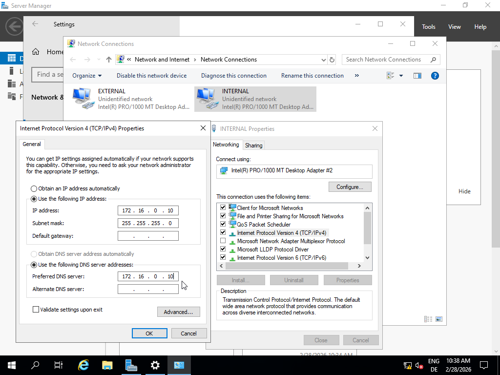

After setting the Adapters, i continued with installing the Windows-Server-2019. Because I wanted a user-friendly graphical interface, I chose the “Desktop Experience” option. It also reflects a more realistic real-world enterprise environment.

After the installation was completed, I navigated to Settings → Network & Internet → Change adapter options.
I then renamed the network adapters from “Ethernet 1” and “Ethernet 2” to “EXTERNAL” and “INTERNAL” to clearly distinguish between the two network roles.

