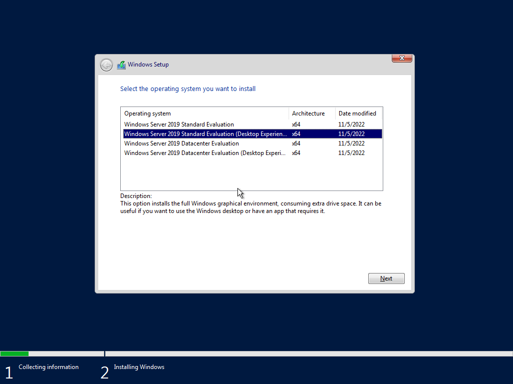

After setting the Adapters, i continued with installing the Windows-Server-2019. Because I wanted a user-friendly graphical interface, I chose the “Desktop Experience” option. It also reflects a more realistic real-world enterprise environment.

