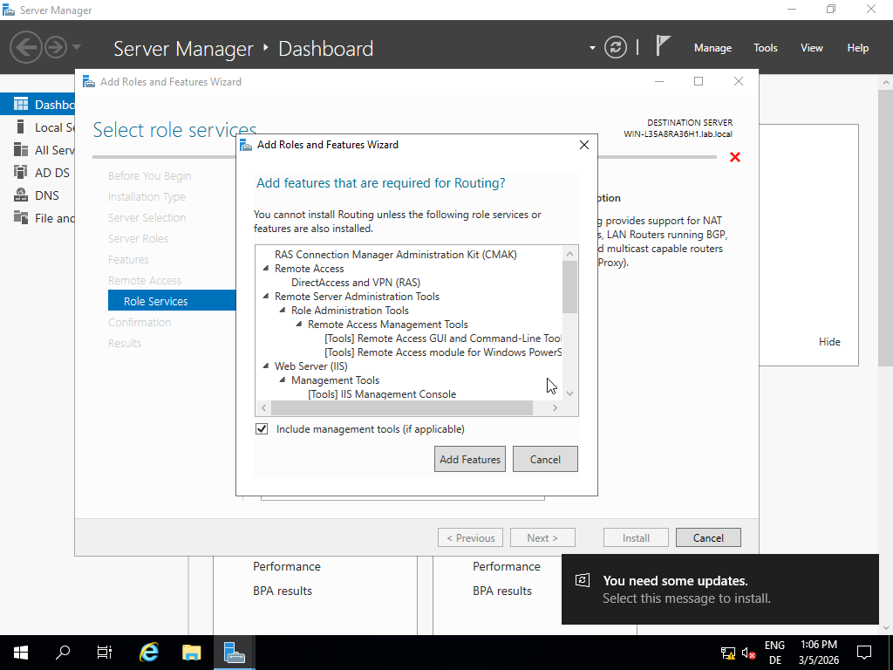
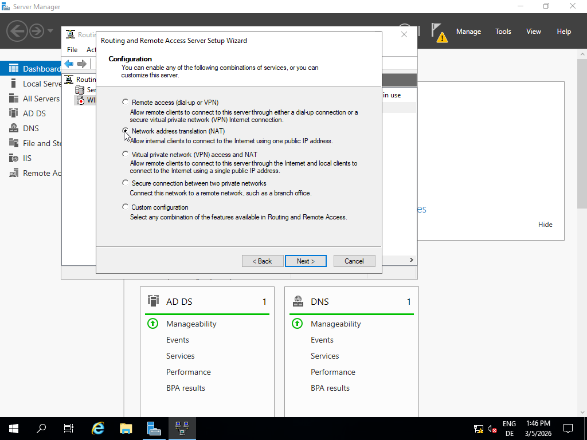
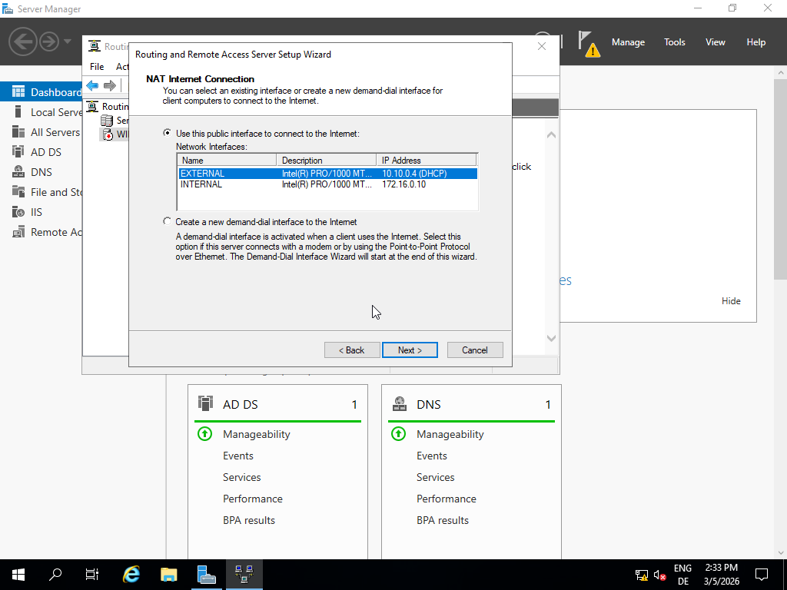

Via Tools → Active Directory Users and Computers, I right-clicked on lab.local, selected New → Organizational Unit, and created an OU named “AdminAccounts.”

Inside this OU, I selected Create a new user in the current container and defined the First name, Last name, Full name, and User logon name.

After setting the designated password, I unchecked “User must change password at next logon” and checked “Password never expires.”

Lastly, I opened the created user account, navigated to the Member Of tab, clicked Add…, and entered “Domain Admins” in the Object names to select field to assign the user to the Domain Admin group.

After creating the Domain Admin account, I proceeded with installing RRAS by navigating to Add Roles and Features and selecting the role Remote Access.

Under Role Services, I selected Routing, which automatically also enabled DirectAccess and VPN (RAS).

After this, i continued to install those features.

After the installation was completed, I navigated to Tools → Routing and Remote Access, right-clicked the designated server, selected Configure and Enable Routing and Remote Access, chose Network Address Translation (NAT),

and configured the EXTERNAL interface as the public interface using “Use this public interface."

