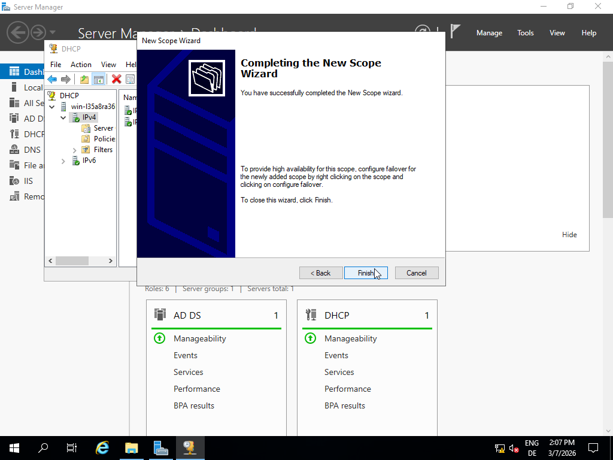

As described earlier, I enabled the DHCP option.

At this stage, I installed the DHCP Server role so that the client would automatically obtain an IP address in the next step.

After the installation, I authorized the DHCP server.

Following the authorization, I navigated to Windows Administrative Tools → DHCP, then right-clicked on IPv4. 

When opening the New Scope Wizard, I first defined a scope name and description.

Before configuring the DHCP scope, I verified the DNS server address and the subnet mask to ensure the correct network information.

Afterwards, I defined the scope IP address range that should be assigned to clients and entered the subnet mask of the server network.

To allow the scope clients to use the correct DNS configuration, I entered the server name and the DNS server IP address. 

With these settings completed, the DHCP scope configuration was finalized.

